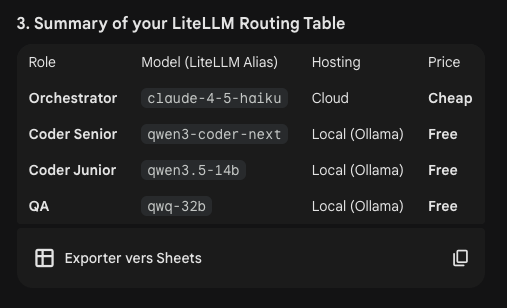

# agents and their job

# 2026.03.03
based on Gemini's answers. 

Keep qwen3-coder-next:q4_K_M as your Primary Worker. It is the most reliable model for writing to your file system and running npm or python commands without hallucinating the syntax.
Pull qwen3.5:35b-moe as a Secondary Specialist. Use this if you are doing frontend work. Its native multimodal training makes it much better at understanding how a layout should look.

# YM2 model history
## qwen3-coder-next:q4_K_M    ca06e9e4087c    55 GB    54%/46% CPU/GPU    32768      4 minutes from now
Could not get it to work, way to slow, killing desktop experience
2026-03-04
deepseek-reasoner rejected as QA (on one task failure)

# ymint
## litellm
~/.local/bin/litellm --port 7000

## claude sessions
## dotOpenClaw
Resume this session with:                                                                                                                     
claude --resume cf710121-a3e0-4382-b89f-e117fe3ef592    

# Notepad
/home/iannick/projects/oc_trading_rs/trading_rs/app_plan/directives/002-lead-viewer.md
/home/iannick/projects/oc_trading_rs/trading_rs/app_backtest/directives/004-first_backtest.md

/home/iannick/projects/oc_trading_rs/trading_rs/project.md
/home/iannick/global_ai/linux_env_repo/general.md
/home/iannick/global_ai/linux_env_repo/layers-strategy.md
/home/iannick/projects/oc_trading_rs/trading_rs/app_plan/directives/005-trades-viewer.md
/home/iannick/global_ai/linux_env_repo/eop.md

## quick commands
for all (except /home/iannick/.openclaw/agents/main/agent/auth-profiles.json) auth-files in /home/iannick/.openclaw/agents
copy /home/iannick/.openclaw/agents/main/agent/auth-profiles.json over the agent's auth-profile.json

when a single green bar does not get higher than hod since setup, and more red bars occur after that, it should be considered a leg invalidate setup. atom 02-18 is a no trade scenario before 10h
